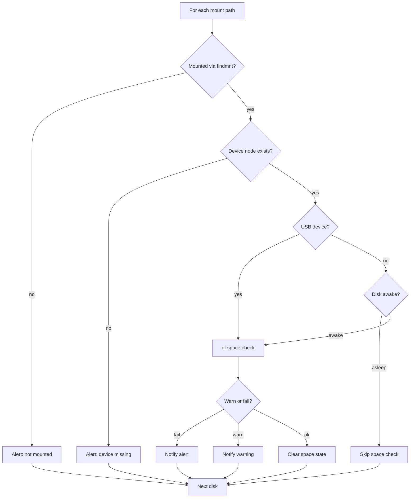

# Unraid Unassigned Disks Monitor

A **User Scripts** helper that monitors **Unassigned Devices** mounts for free space and presence. Unraid's built-in disk alerts do not cover these mounts.

It periodically checks that a configured mount is present and that free space is within warn/fail thresholds, then alerts through Unraid's built-in notification system.

License: [MIT-0](LICENSE) (use freely; no attribution required).

## What it checks


| Check | Behavior |
| --- | --- |
| **Presence** | Mount path is an active mount **and** its block device node still exists |
| **Space** | Used % or free GiB vs warn/fail thresholds |
| **Spin-down (non-USB)** | If the disk is in standby/sleep (`hdparm -C`), **space is skipped** so the check does not wake it |
| **USB** | Space is **always** checked. `hdparm -C` is unreliable on many sticks (often stuck on "standby"), so spin-down skipping is not used |

**USB note:** every scheduled run issues filesystem I/O (`df`) against monitored USB mounts. That can keep a USB disk from staying idle. Prefer a longer cron interval if that matters. Presence checks alone do not require this I/O.

Out of scope: SMART, temperature, remote SMB/NFS Unassigned Devices shares, scheduling inside the script.

## Prerequisites

Install from Community Applications if needed, then configure in the Unraid UI:

- **Unassigned Devices** - disks/mounts to monitor should already be set up
- **User Scripts** (CA User Scripts)
- **Notifications** under **Settings → Notifications** (enable whatever agents you want: GUI, email, Discord, etc.)

## Install

1. Open **Settings → User Scripts** and add a new script.
  - **Name:** `UD Disk Monitor`
  - **Description:** `Monitor Unassigned Devices disks/mounts for presence and free space; alert via Unraid notifications.`
2. Edit the script and paste in the full contents of [`monitor_unassigned_disks.sh`](monitor_unassigned_disks.sh).
3. In the **USER CONFIGURATION** section near the top, set global thresholds and uncomment/add your mounts in the `DISKS` array - see [Configuration](#configuration).
4. Set the schedule to **Custom**, for example every 30 minutes: `*/30 * * * *`
5. Use **Run Script** once to confirm it works. Check Unraid notifications and the User Scripts log output.

Optional dry-run (no notifications): from a terminal,
`bash /boot/config/plugins/user.scripts/scripts/UD\ Disk\ Monitor/script --dry-run`
(adjust the folder name if you used a different script name).

## Configuration

All settings live in the **USER CONFIGURATION** block inside the script (edit in the User Scripts UI).

**Mount path from Unassigned Devices:** on the Unraid **Main** page, find the device under **Unassigned Devices** and copy its **Mount Point** (usually `/mnt/disks/<name>` when mounted). Use that exact path in the `DISKS` array.

```bash
WARN_MODE=percent
WARN_VALUE=80
FAIL_MODE=percent
FAIL_VALUE=90
STATE_DIR=/var/tmp/ud-disk-monitor
SYSLOG_MODE=issues   # issues = notify transitions + fatal errors; all = every message

DISKS=(
  "/mnt/disks/backup||||"
  "/mnt/disks/cameras|free_gb|100|free_gb|50"
)
```

Disk line format: `mount|warn_mode|warn_value|fail_mode|fail_value`  
Empty override fields inherit the globals.


| Mode      | Meaning                         |
| --------- | ------------------------------- |
| `percent` | Alert when **used %** ≥ value   |
| `free_gb` | Alert when **free GiB** ≤ value |


Fail supersedes warn when both would match.

Only monitor disks that should **always** be present (local or always-plugged USB). Removable media you intentionally unplug will alert as missing.

Remember: USB mounts get a space check on **every** run (see [What it checks](#what-it-checks)).

## Alerts and state

- Uses `/usr/local/emhttp/webGui/scripts/notify` with importance `warning` / `alert`, and `normal` on recovery.
- State is stored under `/var/tmp/ud-disk-monitor/` (change `STATE_DIR` in the script, or set env `UD_MONITOR_STATE`).
- On Unraid this path is **RAM-backed and cleared on reboot**. That is intentional:
  - During uptime: notify only on **transitions** (no spam every cron tick).
  - After reboot: if a disk is still bad, you get **one new alert**; if healthy, no recovery notice.
- When a mount comes back after missing, the recovery notification **includes current space warn/fail** if still over threshold (one combined notice, severity matches space).
- To keep state across reboots (usually unnecessary), point `STATE_DIR` at a persistent path.

**Logging**

- **User Scripts log** (stdout): every run - config summary, per-disk OK/skip/warn/fail, run complete.
- **Unraid syslog** (`logger -t ud-disk-monitor`): controlled by `SYSLOG_MODE`
  - `issues` (default) - only when a notification fires (state transitions) and fatal config/script errors
  - `all` - same messages as the script log
- Lines like `emhttpd: cmd: .../user.scripts/startScript.sh ...` come from Unraid/User Scripts when a run is started (especially via **Run Script** in the UI). They are not from this monitor and are not controlled by `SYSLOG_MODE`.


## Maintenance

- **Add/remove a disk or tune thresholds:** edit the USER CONFIGURATION section in User Scripts. Changes apply on the next run.
- **Upgrade the script:** paste the new script, then copy your USER CONFIGURATION block back in.
- **Clear sticky alert state without reboot:** delete `/var/tmp/ud-disk-monitor` (file manager or terminal).
- **Cold non-USB disks:** presence is still monitored; low-space alerts wait until the disk wakes for real work.
- **USB disks:** space is checked every run (I/O on each schedule tick).

## Check logic

Per configured mount path:



